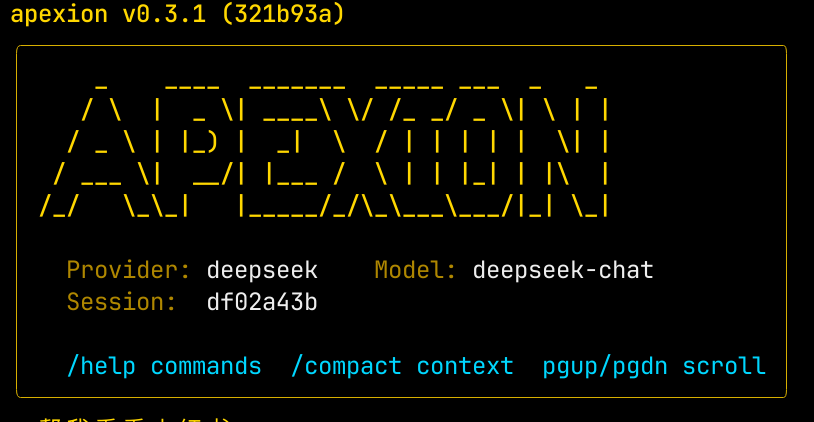

# apexion

> *Immutable Structure, Divine Intelligence.*

**Apex** (pinnacle) + **ion** (energy) — peak intelligence with unstoppable momentum.

AI coding assistant in your terminal. Open-source, model-agnostic.

`apexion` is a pure Go CLI tool that brings an agentic coding experience to your terminal — similar to Claude Code, but open-source and works with any LLM provider.



```
$ apexion
apexion v0.3.1 — deepseek (deepseek-chat)
type your request, /help for commands, /quit to exit
──────────────────────────────────────────────────

> read the main package and tell me what it does
⏺ read_file path="main.go"
  ⎿  (48 lines)
⏺ list_dir path="cmd/"
  ⎿  root.go  run.go  init.go

This is a Go CLI tool that...
```

---

## Features

- **Agentic loop** — LLM plans, calls tools, reads results, iterates until done. No hard iteration cap by default — the model decides when to stop
- **Doom loop protection** — detects when the model repeats the same tool calls and intervenes automatically
- **17 built-in tools** — file read/edit/write, bash, glob, grep, git, web fetch/search, sub-agents, todo tracking, and more
- **MCP protocol** — extend with any [Model Context Protocol](https://modelcontextprotocol.io/) server
- **Streaming TUI** — real-time bubbletea terminal UI with markdown rendering, tool call display, and spinner animations
- **Model-agnostic** — Anthropic, OpenAI, DeepSeek, Qwen, Kimi, GLM, Doubao, Groq, Ollama, or any OpenAI-compatible API
- **Permission system** — interactive, auto-approve, or yolo mode with session-level approval memory
- **Session management** — save, resume, and list sessions. Auto-compaction keeps long conversations within context limits
- **Cross-session memory** — `/memory add` to persist knowledge across sessions
- **Custom commands** — define reusable prompt templates as markdown files
- **Project context** — reads `APEXION.md` (or `AGENTS.md`) to understand your project's conventions
- **Self-healing test loop** — automatically runs tests after edits and feeds failures back to the LLM for fixing
- **Lint auto-fix** — runs linter after edits and lets the LLM fix issues automatically
- **Repository map** — extracts function/type signatures from your codebase for context-aware assistance
- **Architect mode** — dual-model workflow: big model plans, small model executes
- **Background agents** — run parallel sub-agents for concurrent tasks
- **Cost tracking** — real-time token usage and dollar cost tracking with customizable pricing
- **Auto-commit** — automatically commits after successful edits
- **Checkpoints & rollback** — snapshot working tree state and rollback on demand
- **Event log** — structured JSONL event stream for auditing and debugging
- **Hooks system** — pre/post tool hooks for custom automation
- **Pipe mode** — non-interactive output with text/JSONL formats for CI/CD integration
- **Single binary** — `go build` produces one self-contained executable
- **Cross-platform** — macOS, Linux, Windows

---

## Quick Start

```bash
# Install
go install github.com/apexion-ai/apexion@latest

# Configure (interactive wizard)
apexion init

# Start chatting
apexion
```

Or with environment variables:

```bash
export LLM_API_KEY=your-key
export LLM_BASE_URL=https://api.deepseek.com   # omit for OpenAI
export LLM_MODEL=deepseek-chat

apexion
```

---

## Installation

### Go (recommended)

```bash
go install github.com/apexion-ai/apexion@latest
```

### Build from source

```bash
git clone https://github.com/apexion-ai/apexion
cd apexion
go build -o apexion .
```

### Pre-built binaries

Download from [GitHub Releases](https://github.com/apexion-ai/apexion/releases) for macOS, Linux, and Windows (amd64 / arm64).

---

## Configuration

### Config file

`apexion init` creates `~/.config/apexion/config.yaml`:

```yaml
provider: deepseek
model: deepseek-chat

providers:
  anthropic:
    api_key: sk-ant-...
    model: claude-opus-4-5

  deepseek:
    api_key: sk-...
    model: deepseek-chat

  openai:
    api_key: sk-...
    model: gpt-4o

  qwen:
    api_key: sk-...
    base_url: https://dashscope.aliyuncs.com/compatible-mode/v1
    model: qwen-max

# 0 = unlimited (default). Loop exits when model stops calling tools.
# Set to a positive number as a safety cap.
max_iterations: 0

# Override provider's default context window size. 0 = use provider default.
context_window: 0

permissions:
  mode: interactive          # interactive | auto-approve | yolo
  auto_approve_tools:
    - read_file
    - glob
    - grep
    - list_dir
    - web_fetch
    - web_search
  allowed_commands:          # bash command whitelist (prefix match)
    - go test
    - go build
  denied_commands:           # blacklist (enforced even in yolo mode)
    - rm -rf /

web:
  search_provider: tavily    # tavily | exa | jina (free, no key)
  search_api_key: tvly-...

# Self-healing test loop
test:
  enabled: true
  commands:
    ".go": "go test ./... -count=1"
    ".py": "pytest {{.file}}"
  max_retries: 3               # max auto-fix attempts per edit

# Lint auto-fix
lint:
  enabled: true
  commands:
    ".go": "golangci-lint run {{.file}}"
    ".js": "eslint {{.file}}"
  max_fixes: 3                 # max auto-fix attempts per edit

# Repository map
repo_map:
  disabled: false
  max_tokens: 4096             # token budget for system prompt injection
  exclude:                     # glob patterns to exclude
    - "*.generated.go"

# Architect mode
architect:
  architect_model: claude-opus-4      # big model for planning
  coder_model: claude-haiku-4-5       # small model for execution
  auto_execute: false                 # skip per-step confirmation

# Custom cost pricing (extends built-in pricing table)
cost_pricing:
  my-custom-model:
    input_per_million: 5.0
    output_per_million: 15.0

# Automatic features
auto_commit: false             # auto-commit after file edits
auto_checkpoint: false         # auto-checkpoint before code sub-agents
```

### Environment variables

| Variable | Description |
|----------|-------------|
| `LLM_API_KEY` | API key for the current provider |
| `LLM_BASE_URL` | Base URL (for OpenAI-compatible providers) |
| `LLM_MODEL` | Model override |
| `ANTHROPIC_API_KEY` | Anthropic API key |
| `APEXION_PROVIDER` | Provider selection (`deepseek`, `anthropic`, etc.) |
| `APEXION_MODEL` | Model selection |
| `TAVILY_API_KEY` | Tavily search API key |
| `EXA_API_KEY` | Exa search API key |

### Project context — APEXION.md

Create `APEXION.md` in your project root to give apexion persistent knowledge about your project:

```markdown
# My Project

## Rules
- Test command: make test
- Never modify files under vendor/
- Commit messages must be in English
- Entry point is cmd/server/main.go
```

apexion loads this file automatically and injects it into the system prompt. Also supports `~/.config/apexion/context.md` for global preferences.

---

## Usage

### Interactive mode (default)

```bash
apexion
```

Type any natural language request. apexion will plan and execute using its tools.

### Non-interactive mode

```bash
apexion run -P "add error handling to the login function in auth/handler.go"
apexion run -P "run the tests and fix any failures"
```

### Pipe mode

Pipe mode enables non-interactive usage for scripting and CI/CD:

```bash
# Pipe input
echo "explain main.go" | apexion run --pipe

# Structured JSON output
apexion run -P "list all TODO comments" --pipe --output-format jsonl | jq '.'

# Only print the final response
apexion run -P "summarize this project" --pipe --print-last
```

In pipe mode, all tool confirmations are automatically approved and the TUI is disabled.

**Output formats:**
- `text` (default) — LLM text to stdout, tool calls to stderr
- `jsonl` — line-delimited JSON events: `{"type":"text|tool_start|tool_done", "data":{...}}`

### CLI flags

```
apexion [flags]

Flags:
  -p, --provider string        Override provider (deepseek, anthropic, openai, ...)
  -m, --model string           Override model
  -c, --config string          Config file path (default ~/.config/apexion/config.yaml)
      --auto-approve           Skip all tool execution confirmations
      --max-turns int          Max agent loop iterations (0=unlimited, default 0)
      --tui                    Force bubbletea TUI mode (auto-detected by default)
      --pipe                   Force pipe mode (no TUI, auto-approve all tools)
      --output-format string   Output format: text | jsonl (default "text")
      --print-last             Only print the final LLM response
```

### Slash commands

| Command | Description |
|---------|-------------|
| `/help` | Show all available commands |
| `/quit`, `/exit`, `/q` | Save and exit |
| `/clear` | Clear conversation history |
| `/history` | Show message history |
| `/model <name>` | Switch model at runtime |
| `/provider <name>` | Switch provider at runtime |
| `/config` | Show current configuration |
| `/plan` | Toggle plan mode (read-only analysis) |
| `/compact` | Manually trigger context compaction |
| `/changes` | Show files modified in this session |
| `/trust` / `/trust reset` | Show or clear session-level tool approvals |
| `/rules` | List loaded rules |
| `/skills` | List available skills |
| `/commands` | List custom commands |
| `/memory` | List saved memories |
| `/memory add <text>` | Save a memory (use `#tag` to add tags) |
| `/memory search <q>` | Search memories |
| `/memory delete <id>` | Delete a memory |
| `/mcp` / `/mcp reset` | Show MCP server status or reconnect |
| `/audit` | Show bash command audit log |
| `/save` | Save current session |
| `/sessions` | List saved sessions |
| `/resume <id>` | Resume a saved session (short ID prefix) |
| `/cost` | Show token usage and dollar cost |
| `/test <file>` | Run configured test command for a file |
| `/map` / `/map refresh` | Show or refresh the repository map |
| `/architect` / `/architect auto` | Activate architect mode (with optional auto-execute) |
| `/bg` | List background agents |
| `/bg collect [id]` | Collect output from completed background agents |
| `/bg cancel <id>` | Cancel a running background agent |
| `/bg wait` | Wait for all background agents to finish |
| `/checkpoint [msg]` | Create a named checkpoint |
| `/rollback [id]` | Rollback to a checkpoint (default: latest) |
| `/checkpoints` | List all checkpoints |
| `/autocommit` | Toggle auto-commit on/off |
| `/events [n]` | Show recent event log entries |
| `/hooks` | List configured hooks |

---

## Built-in Tools

| Tool | Permission | Description |
|------|-----------|-------------|
| `read_file` | Auto | Read file contents with line numbers, supports offset/limit |
| `edit_file` | Ask | Exact string replace — precise, no diff parsing |
| `write_file` | Ask | Create new files (parent dirs created automatically) |
| `bash` | Ask | Execute shell commands with timeout (supports background mode) |
| `glob` | Auto | Find files by glob pattern (e.g., `**/*.go`) |
| `grep` | Auto | Search file contents by regex with glob filtering |
| `list_dir` | Auto | List directory contents with sizes |
| `git_status` | Auto | Show working tree status |
| `git_diff` | Auto | Show changes (staged/unstaged) |
| `git_commit` | Ask | Stage files and commit |
| `git_push` | Confirm | Push to remote (requires explicit confirmation) |
| `web_fetch` | Auto | Fetch web page and convert to markdown (15-min cache) |
| `web_search` | Auto | Web search via Tavily, Exa, or Jina |
| `task` | Auto | Launch read-only sub-agent for research tasks |
| `todo_write` | Auto | Create/update todo list for multi-step tasks |
| `todo_read` | Auto | Read current todo list |
| `question` | Auto | Ask user clarifying questions with options |

**Permission levels:**
- **Auto** — executed immediately (read-only operations)
- **Ask** — terminal prompt `[y/N]` before execution
- **Confirm** — prominent warning before execution (destructive operations)

---

## MCP (Model Context Protocol)

apexion supports MCP servers for extensibility. Create `~/.config/apexion/mcp.json` or `.apexion/mcp.json` in your project:

```json
{
  "mcpServers": {
    "filesystem": {
      "command": "npx",
      "args": ["-y", "@modelcontextprotocol/server-filesystem", "/tmp"],
      "env": { "KEY": "${ENV_VAR}" }
    },
    "remote": {
      "url": "https://mcp.example.com/sse"
    }
  }
}
```

Supports **stdio** (child process), **Streamable HTTP** (2025 spec), and **SSE** (2024 legacy spec) transports. When `url` is configured without explicit `type`, apexion auto-detects the protocol. Project-level config overrides global config. Use `/mcp` to check connection status.

### Recommended MCP Servers

#### Context7 — Up-to-date library documentation

Provides current documentation for popular libraries, avoiding hallucinated or outdated API usage.

```json
{
  "mcpServers": {
    "context7": {
      "command": "npx",
      "args": ["-y", "@upstash/context7-mcp@latest"]
    }
  }
}
```

#### Sequential Thinking — Complex problem solving

Helps with multi-step reasoning and complex architectural decisions.

```json
{
  "mcpServers": {
    "sequential-thinking": {
      "command": "npx",
      "args": ["-y", "@anthropic/sequential-thinking-mcp@latest"]
    }
  }
}
```

#### Filesystem — Sandbox file access

Provides sandboxed file access to a specific directory, useful for restricting operations.

```json
{
  "mcpServers": {
    "filesystem": {
      "command": "npx",
      "args": ["-y", "@modelcontextprotocol/server-filesystem", "/path/to/allowed/dir"]
    }
  }
}
```

---

## Custom Commands

Define reusable prompt templates as markdown files in `.apexion/commands/` or `~/.config/apexion/commands/`:

```markdown
---
name: review
description: Code review for a file
args:
  - name: file
    required: true
---
Review {{.file}} for bugs, security issues, and style problems.
Focus on correctness first, then readability.
```

Then use it: `/review src/auth/handler.go`

List all custom commands with `/commands`.

---

## Rules

Define modular rules in `.apexion/rules/` or `~/.config/apexion/rules/` as markdown files:

```markdown
---
description: "Go coding conventions"
---
- Use snake_case for file names
- Always run `go vet` before committing
- Prefer table-driven tests
```

Rules can optionally include `path_patterns` in frontmatter for scoped activation:

```markdown
---
description: "Frontend rules"
path_patterns:
  - "*.tsx"
  - "src/components/**"
---
Use functional components with hooks.
```

Rules without `path_patterns` are always active. Use `/rules` to list loaded rules.

---

## Skills

Place domain knowledge files in `.apexion/skills/` or `~/.config/apexion/skills/` as markdown files. The LLM is informed of available skills and can load them on demand using `read_file`.

```
.apexion/skills/
  go-patterns.md      # Go coding patterns for this project
  api-design.md       # API design conventions
  deployment.md       # Deployment procedures
```

Use `/skills` to list available skills.

---

## Plan Mode

Toggle plan mode with `/plan`. In plan mode:

- Only read-only tools are available (no file modifications, no bash)
- The LLM analyzes and proposes a plan instead of executing
- The status bar shows a "PLAN" indicator

Use this to review the agent's approach before allowing execution.

---

## Advanced Features

### Self-Healing Test Loop

After every `write_file` or `edit_file`, apexion can automatically run your test suite and feed failures back to the LLM:

```
User: "add a Fibonacci function to math.go"
→ LLM writes math.go
→ apexion runs `go test ./... -count=1`
→ Test fails: "TestFib: expected 5, got 4"
→ LLM reads failure, fixes the off-by-one bug
→ apexion re-runs tests → PASS
```

Configure test commands per file extension in `config.yaml`:

```yaml
test:
  enabled: true
  commands:
    ".go": "go test ./... -count=1"
    ".py": "pytest {{.file}}"
    ".ts": "npx jest {{.file}}"
  max_retries: 3
```

Use `/test <file>` to manually run a test command for a specific file.

### Lint Auto-Fix

Runs your linter automatically after file edits (before the test loop), feeding lint errors back to the LLM:

```yaml
lint:
  enabled: true
  commands:
    ".go": "golangci-lint run {{.file}}"
    ".js": "eslint {{.file}}"
    ".py": "ruff check {{.file}}"
  max_fixes: 3
```

The execution order after each file edit is: **lint → test → auto-commit**.

### Repository Map

apexion can extract function and type signatures from your codebase and inject them into the system prompt, giving the LLM a birds-eye view of your project structure.

```yaml
repo_map:
  disabled: false
  max_tokens: 4096
  exclude:
    - "*.generated.go"
    - "testdata/**"
```

Use `/map` to view the current repository map. Use `/map refresh` to rebuild it.

**Supported languages:** Go (AST-parsed), Python, TypeScript, JavaScript, Rust, Java, Ruby, C/C++ (regex-based).

### Architect Mode

A dual-model workflow for complex tasks: a large model creates a step-by-step plan, then a smaller model executes each step.

```yaml
architect:
  architect_model: claude-opus-4      # planning model
  coder_model: claude-haiku-4-5       # execution model
  auto_execute: false                 # require confirmation per step
```

**Usage:**
- `/architect` — activate for the next prompt (manual step approval)
- `/architect auto` — activate with auto-execution (no per-step confirmation)

**Workflow:**
1. You provide a request
2. The architect model produces a structured JSON plan with steps
3. You review the plan (file changes, actions, descriptions)
4. Each step is executed by the coder model as a focused sub-agent

### Background Agents

Run parallel sub-agents without blocking the main conversation:

| Command | Description |
|---------|-------------|
| `/bg` | List all background agents with status |
| `/bg collect [id]` | Collect output from completed agents |
| `/bg cancel <id>` | Cancel a running agent |
| `/bg wait` | Block until all agents complete |

Up to 4 concurrent background agents by default. Agents notify you when they complete.

### Cost Tracking

apexion tracks token usage and dollar cost per turn with built-in pricing for major models (Claude, GPT-4o, DeepSeek, Gemini, etc.).

Use `/cost` to view a detailed breakdown:

```
Session cost: $0.0342 (5 turns)

  Turn 1: deepseek-chat  in=1200 out=800  $0.0012
  Turn 2: deepseek-chat  in=3500 out=1200  $0.0023
  ...

Total tokens: 12000 input + 4500 output = 16500
```

Add custom model pricing in `config.yaml`:

```yaml
cost_pricing:
  my-custom-model:
    input_per_million: 5.0
    output_per_million: 15.0
```

### Auto-Commit

Automatically commit after successful file edits (after lint and test checks pass):

```yaml
auto_commit: true
```

Toggle at runtime with `/autocommit`. Commits use the format `apexion: <tool> <filename>`.

### Checkpoints

Snapshot your working tree and rollback on demand:

| Command | Description |
|---------|-------------|
| `/checkpoint [msg]` | Create a named checkpoint |
| `/rollback [id]` | Rollback to checkpoint (default: latest) |
| `/checkpoints` | List all checkpoints |

```yaml
auto_checkpoint: true   # auto-snapshot before code sub-agents
```

Checkpoints use `git stash create` internally — your working tree is not modified when creating a checkpoint. Rollback restores the full state.

### Event Log

All agent activity is logged as structured JSONL events:

```
~/.local/share/apexion/events/{session_id}.jsonl
```

Each event includes type, timestamp, session ID, and data:

```json
{"type":"tool_call","ts":"2025-01-15T10:30:00Z","session_id":"abc123","data":{"tool_name":"read_file"}}
```

Event types: `session_start`, `user_message`, `assistant_text`, `tool_call`, `tool_result`, `compaction`, `error`, `session_end`.

Use `/events [n]` to view the last `n` events.

### Hooks System

Define pre/post tool hooks for custom automation. Create `.apexion/hooks.yaml` or `~/.config/apexion/hooks.yaml`:

```yaml
hooks:
  pre_tool:
    - matcher: "write_file|edit_file"    # regex pattern matching tool names
      command: "sh ./scripts/pre-edit.sh"
      timeout: 10                         # seconds (default: 10)

  post_tool:
    - matcher: "bash"
      command: "sh ./scripts/post-bash.sh"
      timeout: 10

  session_start:
    - command: "echo 'session started'"

  session_stop:
    - command: "sh ./scripts/cleanup.sh"

  notification:
    - command: "sh ./scripts/notify.sh"
```

**Hook events:**
- `pre_tool` — runs before a tool call. Exit code 2 blocks the tool (stderr becomes the error message)
- `post_tool` — runs after a tool call. Failures are silently ignored
- `session_start` / `session_stop` — lifecycle events
- `notification` — custom notification events

Hooks receive JSON on stdin: `{"tool_name":"write_file","params":{...}}`. Use `/hooks` to list configured hooks.

### AGENTS.md Compatibility

apexion supports `AGENTS.md` as a project context file, compatible with the emerging open standard for providing AI agents with project-specific instructions. Place `AGENTS.md` in your project root (alongside or instead of `APEXION.md`), and apexion will load it automatically.

---

## Sandbox

Configure bash tool restrictions in `config.yaml`:

```yaml
sandbox:
  work_dir: /path/to/project    # restrict bash to this directory
  audit_log: /tmp/apexion.log   # log all bash commands
```

Use `/audit` to view recent bash commands from the audit log.

---

## Doom Loop Detection

When the agent runs without an iteration cap (default), a built-in doom loop detector prevents infinite loops:

- **Warning (3x)** — if the model issues the same tool calls 3 times in a row, a hint is injected into the conversation asking it to try a different approach
- **Stop (5x)** — if the same tool calls repeat 5 times, the loop is force-stopped

You can also set a hard cap via config (`max_iterations: 30`) or CLI flag (`--max-turns 30`) as an additional safety valve.

---

## Supported Providers

### International

| Provider | Config key | Notes |
|----------|-----------|-------|
| **Anthropic** | `anthropic` | Claude Opus, Sonnet, Haiku (native API) |
| **OpenAI** | `openai` | GPT-4o, o1, etc. |
| **Groq** | `groq` | Fast inference, Llama models |
| **Ollama** | `ollama` | Local models |

### Chinese models (OpenAI-compatible)

| Provider | Config key | Recommended model |
|----------|-----------|------------------|
| **DeepSeek** | `deepseek` | `deepseek-chat` |
| **Qwen (Alibaba)** | `qwen` | `qwen-max` |
| **Kimi (Moonshot)** | `kimi` | `moonshot-v1-128k` |
| **GLM (Zhipu)** | `glm` | `glm-4` |
| **Doubao (ByteDance)** | `doubao` | `doubao-pro-32k` |
| **MiniMax** | `minimax` | `abab6.5-chat` |

All OpenAI-compatible providers share the same adapter — only `api_key` and `base_url` differ.

---

## Architecture

```
apexion/
├── main.go                    # Entry point
├── cmd/                       # CLI commands (cobra)
│   ├── root.go                # Global flags, provider setup
│   ├── chat.go                # Interactive mode
│   ├── run.go                 # Non-interactive mode
│   └── init.go                # Config wizard
└── internal/
    ├── agent/                 # Agentic loop + REPL
    │   ├── agent.go           # Core agent, slash commands, system prompt
    │   ├── loop.go            # LLM → tool → result → repeat
    │   ├── doomloop.go        # Doom loop detection
    │   ├── commands.go        # Custom commands loader
    │   └── prompts/           # Modular system prompt sections
    ├── provider/              # LLM adapters
    │   ├── provider.go        # Unified interface + event types
    │   ├── openai.go          # OpenAI-compatible adapter
    │   └── anthropic.go       # Anthropic native adapter
    ├── tools/                 # 17 tool implementations
    ├── tui/                   # Bubbletea TUI + plain IO
    ├── session/               # Conversation history, memory, compaction
    ├── permission/            # Permission policy + approval memory
    ├── mcp/                   # MCP client + config loader
    └── config/                # Config loading (YAML + env vars)
```

The provider interface emits a unified `Event` stream (`TextDelta`, `ToolCallDone`, `Done`, `Error`), isolating the agentic loop from provider-specific streaming formats.

---

## Contributing

Contributions are welcome. Please read [CONTRIBUTING.md](CONTRIBUTING.md) before submitting a PR.

```bash
git clone https://github.com/apexion-ai/apexion
cd apexion
go build ./...
go test ./...
```

---

## Complete Configuration Reference

Full annotated `config.yaml` covering all configuration options:

```yaml
# ─── Provider & Model ───────────────────────────────────────────────
provider: deepseek                    # active provider
model: deepseek-chat                  # model override (empty = provider default)
context_window: 0                     # override context window (0 = provider default)
sub_agent_model: ""                   # model for sub-agents (empty = main model)
system_prompt: ""                     # custom system prompt (empty = built-in default)
max_iterations: 0                     # max agent loop iterations (0 = unlimited)

# ─── Provider Credentials ───────────────────────────────────────────
providers:
  anthropic:
    api_key: sk-ant-...
    model: claude-opus-4-5
  openai:
    api_key: sk-...
    model: gpt-4o
  deepseek:
    api_key: sk-...
    model: deepseek-chat
  qwen:
    api_key: sk-...
    base_url: https://dashscope.aliyuncs.com/compatible-mode/v1
    model: qwen-max
  kimi:
    api_key: sk-...
    base_url: https://api.moonshot.cn/v1
    model: moonshot-v1-128k
  glm:
    api_key: ...
    base_url: https://open.bigmodel.cn/api/paas/v4
    model: glm-4
  doubao:
    api_key: ...
    base_url: https://ark.cn-beijing.volces.com/api/v3
    model: doubao-pro-32k
  groq:
    api_key: gsk_...
    model: llama-3.1-70b-versatile
  ollama:
    base_url: http://localhost:11434/v1
    model: llama3.1

# ─── Permissions ────────────────────────────────────────────────────
permissions:
  mode: interactive                   # interactive | auto-approve | yolo
  auto_approve_tools:
    - read_file
    - glob
    - grep
    - list_dir
    - web_fetch
    - web_search
  allowed_commands:                   # bash whitelist (prefix match)
    - go test
    - go build
    - npm test
  allowed_paths: []                   # file path globs (empty = all allowed)
  denied_commands:                    # blacklist (enforced even in yolo mode)
    - rm -rf /

# ─── Web Search ─────────────────────────────────────────────────────
web:
  search_provider: tavily             # tavily | exa | jina
  search_api_key: tvly-...

# ─── Sandbox ────────────────────────────────────────────────────────
sandbox:
  work_dir: ""                        # restrict bash to this directory
  audit_log: ""                       # log all bash commands to this file

# ─── Self-Healing Test Loop ─────────────────────────────────────────
test:
  enabled: false
  commands:                           # map file extension → test command
    ".go": "go test ./... -count=1"
    ".py": "pytest {{.file}}"
    ".ts": "npx jest {{.file}}"
  max_retries: 3                      # max auto-fix attempts per edit

# ─── Lint Auto-Fix ──────────────────────────────────────────────────
lint:
  enabled: false
  commands:                           # map file extension → lint command
    ".go": "golangci-lint run {{.file}}"
    ".js": "eslint {{.file}}"
    ".py": "ruff check {{.file}}"
  max_fixes: 3                        # max auto-fix attempts per edit

# ─── Repository Map ─────────────────────────────────────────────────
repo_map:
  disabled: false
  max_tokens: 4096                    # token budget for system prompt injection
  exclude:                            # glob patterns to exclude from map
    - "*.generated.go"
    - "testdata/**"

# ─── Architect Mode ─────────────────────────────────────────────────
architect:
  architect_model: ""                 # planning model (empty = main model)
  coder_model: ""                     # execution model (empty = sub_agent_model)
  auto_execute: false                 # skip per-step confirmation

# ─── Cost Tracking (Custom Pricing) ─────────────────────────────────
cost_pricing:                         # extends built-in pricing table
  my-custom-model:
    input_per_million: 5.0
    output_per_million: 15.0

# ─── Automatic Features ─────────────────────────────────────────────
auto_commit: false                    # auto-commit after successful edits
auto_checkpoint: false                # auto-checkpoint before code sub-agents
```

---

## License

Apache License 2.0 — see [LICENSE](LICENSE).
